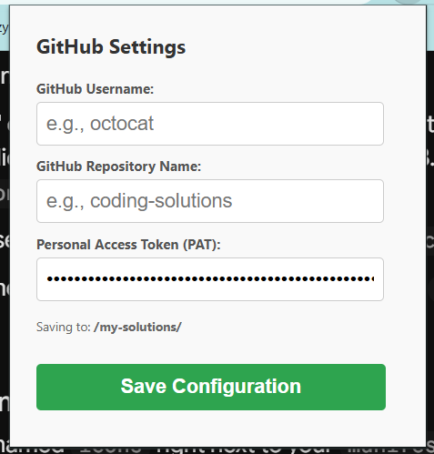

# LeetSync 🚀

Auto-syncs LeetCode solutions to GitHub and updates the topic-wise README.

## ✨ Features

* **Automated Syncing:** Pushes your code to GitHub immediately after an accepted submission on LeetCode.
* **Smart Organization:** Categorizes and stores your solutions based on problem difficulty and topics.
* **Auto-Updating README:** Dynamically updates a master `README.md` in your repository with links to your newly solved problems.
* **Secure Token Storage:** Safely stores your GitHub Personal Access Token (PAT) locally in your browser.

## 🛠️ Installation

Currently, this extension is loaded as an unpacked developer extension. 

1. **Clone the repository:**
   ```bash
   git clone [https://github.com/ashishpatidar123/leetsync.git](https://github.com/ashishpatidar123/leetsync.git)

2. **Open Extension Settings:**
   Navigate to `chrome://extensions/` (or `edge://extensions/` if using Edge) in your browser.
3. **Enable Developer Mode:**
   Toggle the **Developer mode** switch in the top right corner.
4. **Load the Extension:**
   Click on the **Load unpacked** button in the top left and select the folder where you cloned this repository.

## ⚙️ Configuration & Usage

Before LeetSync can push code on your behalf, you need to connect it to your GitHub account.

1. Pin the LeetSync extension to your browser toolbar.
2. Click the LeetSync icon to open the configuration panel.

   

3. **Enter your GitHub PAT:** Generate a Personal Access Token (Classic) from your GitHub Developer Settings with `repo` permissions and paste it here.
4. **Enter your Repository Name:** Provide the name of the repository where you want your solutions saved (e.g., `ashishpatidar123/leetcode-solutions`). If the repository does not exist, create it first.
5. **Save & Sync:** Click save.
6. **Solve:** Head over to LeetCode and submit a successful solution. LeetSync will handle the rest in the background!

## 💻 Built With

* Vanilla JavaScript
* Chrome Extension API Manifest V3
* GitHub REST API